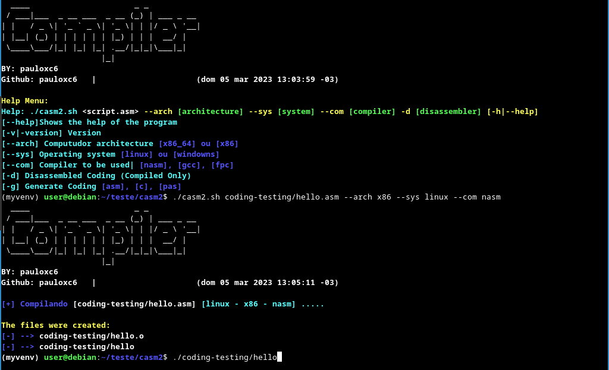

# casm2

The code is a shell script that compiles programs in NASM assembly, C language, and Pascal. The script is also able to disassemble files compiled into the NASM assembly. The script supports x86 and x86_64 and Linux and Windows operating systems.

### Install
The script needs some programs to work. Install with the command:

`` sudo ./install.sh ``

### How to use
The script parses the arguments passed to the script and performs the appropriate action based on the argument. If the argument is "-h" or "--help", the help option is displayed. If the argument is "-v" or "--version", the script version is displayed. If the argument is "--arch", "--sys" or "--com", the corresponding variable is updated with the value provided by the user. If the argument is "-d", the compiled file is dismounted (disassembled). If the argument is "-g", the source code is generated using the appropriate function and is displayed on the screen.

`` ./casm2.sh --help ``
#### HELP:

Help Menu: 
Help: ./casm2.sh <script.asm> --arch [architecture] --sys [system] --com [compiler] -d [disassembler] [-h|--help] 
[--help] Shows the help of the program 
[-v|-version] Version 
[--arch] Computer artitetura [x86_64] ou [x86] 
[--sys] Operating system [linux] ou [windowns] 
[--com] Compiler to be used | [nasm], [gcc], [fpc] 
[-d] Disassembler Code (Somente Compilado) 
[-g] Generate Code [asm], [c], [pas] 

## Assembler

`` ./casm2.sh <script.asm> --arch x86 --sys linux --com nasm ``

## C

`` ./casm2.sh <script.c> --arch x86_64 --sys linux --com gcc ``

## Pascal

`` ./casm2.sh <script.pas> --arch x86_64 --sys windows --com fpc ``

## Disassembler
The script can also disassemble the executable file in machine language using the "-d" option.

#### Linux
``./casm2.sh <script> --sys linux -d``

#### Windows
``./casm2.sh <script> --sys windows -d``

## Generator Code
This function generates code of the user's choice, with this function you can print a scope of the code to make its life easier.

``./casm2.sh -g asm`` 
``./casm2.sh -g c`` 
``./casm2.sh -g pas`` 
